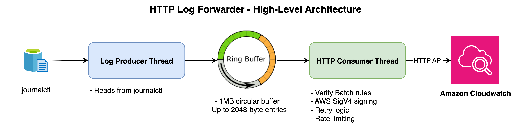
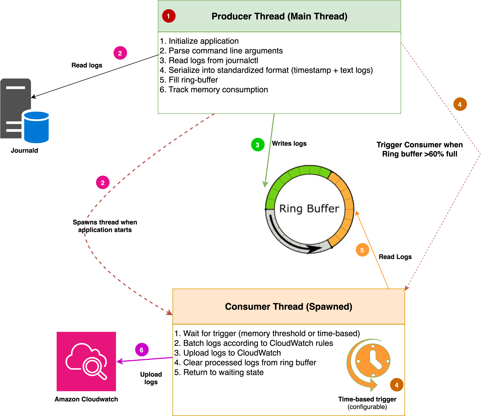

# System Log Forwarder - Design Doc

## Overview

The AWS Greengrass System Log Forwarder is a generic component designed to
collect system logs from embedded devices running Greengrass and forward them to
AWS CloudWatch. This component is optimized for resource-constrained
environments and will be a lightweight replacement to current Log Manager for
Greengrass. We have decided to use an **HTTP-based** version based on the
internal journald MQTT vs HTTP Comparison document.



## Design Requirements

- **Direct Integration**: Use direct CloudWatch API for a simplified
  architecture and billing.
- **Efficient Memory Usage**: Utilize ring buffer (user configurable size) for
  optimal memory management.
- **Scalable Performance**: Support high-throughput log processing with
  batching.
- **Best Effort Delivery**: The component aims to deliver logs at best effort.
- **Resource Efficiency**: Minimize CPU and network overhead.
- **Active Uploads**: Logs will only be transmitted during _active runtime_ of
  Log Forwarder.
- **Avoid Duplicates:** To make sure customers aren’t billed unnecessarily.

## Architecture



The component employs a producer-consumer architecture with two primary threads:

1. **Producer Thread**: Responsible for continuously reading logs from
   `journalctl` and converting them into a standardized format (timestamp and
   text logs). As logs are collected, they're stored in an in-memory ring
   buffer. The producer monitors memory usage and triggers the consumer thread
   when the buffer exceeds **60% capacity**, ensuring efficient resource
   utilization.
2. **Consumer Thread**: Handles the batching and uploading of logs to AWS
   CloudWatch while applying the
   [batching rules](https://docs.aws.amazon.com/AmazonCloudWatchLogs/latest/APIReference/API_PutLogEvents.html).
   The consumer operates on two triggers: a notification-based trigger activated
   by the producer, and a configurable time-based trigger that initiates log
   uploads after a specified interval. The batching process follows CloudWatch's
   payload requirements to ensure compatibility. After successful uploads, the
   consumer clears the processed logs from the ring buffer.

This architecture operates entirely in memory, eliminating disk I/O operations
for improved performance. The component is designed to be resilient, tolerating
scenarios where older logs might be overwritten if network connectivity is down
for a prolonged time or if the consumer cannot process logs quickly enough. This
approach prioritizes system stability and continuous operation over guaranteed
delivery of every historical log entry.

## Configuration

The following configuration values should be supported in the initial iteration
of log forwarder:

- `maxUploadIntervalSec` - The maximum period at which log forwarder will
  attempt to upload logs. Since log forwarder will upload logs when the memory
  fills, it may still upload more often than the configured maximum cadence.
  - Default: `300` (5 minutes)
- `bufferCapacity` - The size of the ring buffer for in-memory log storage.
  - Default: `1024 * 1024` (1MB)
- `logGroup` - This will have a default recipe value but will be a required
  field if compiled as command line argument. This is the log path in
  CloudWatch.
  - Default: `'greengrass/systemLogs'`
- `logStream` - GG Recipe will provide a default value of thing name but will be
  a required field if compiled as command line argument. Provides the related
  logStream in CloudWatch.
  - Default: `iot:thingName`
- `filters > Services` - Select the logs that the user wants to upload to cloud.
  Initial support only covers `ggl.` for all greengrass services and `*` for all
  services. Also exact name match of a service will also be supported.
  - Default: `["ggl.*"]`

### Future config support

- `filters > Services` (optional) - Support for regex based service name
  support.
  - Default: `["ggl.*"]` (not set)
- `logforwarderLogLevel` - Runtime flag to set the output from the
  `system log forwarder` component itself
  - Default: `INFO`

## Appendix

### Batching and Rate Limiting

For the HTTP consumer thread to successfully upload logs to CloudWatch Logs, all
requests to the PutLogEvents API endpoint must follow a strict set of
constraints, or else the requests will fail. Specific constraints can be found
on the
[PutLogEvents docs page](https://docs.aws.amazon.com/AmazonCloudWatchLogs/latest/APIReference/API_PutLogEvents.html).

The consumer thread will need to ensure that log events in the request satisfy
these constraints, and if they do not, then create a separate batch for subsets
of log events that do satisfy the API constraints and upload these separately.
For example, logs cannot have timestamps that span more than 24 hours of time
(we must upload multiple batches) and we must upload logs in chronological order
(while incoming logs should arrive in time-order, we must at least verify this,
and sort if necessary).

In addition to ensuring that log events satisfy API requirements, the log
forwarder should avoid hitting service limits or quotas to avoid throttling.
From the
[documentation](https://docs.aws.amazon.com/AmazonCloudWatch/latest/logs/cloudwatch_limits_cwl.html),
the `PutLogEvents` API supports a **quota** of **5000 transactions per second
per account per region**. While an individual device can never be sure if the
sum of all device traffic is exceeding these limits, we can set reasonable
default configuration values. It is unlikely that an individual device using log
forwarder will ever reach these limits.

There is a _maximum batch_ size for this API of **1 MB**. Thus, log forwarder
will need to upload logs before then or split a request into multiple batches.
With a **1 MB ring buffer**, we should not be exceeding this limit for a single
batch, but this value may be configured by the customer.

### Retries

If a call fails due to a retryable error code (408, 429, 502, 503, 504), then
log forwarder may retry up to 3 times (configurable) with backoff. For the
initial design, these are the only retries that will occur, so for example if
the network on the device is offline for an extended period of time, it may be
reasonable to expect some logs to be missing in the cloud.

### Hub and Spoke Considerations

The above design should be easily extendable to hub and spoke device models,
using built-in systemd functionality. A customer can use
`systemd-journal-remote` on the hub device and `systemd-journal-upload` on spoke
devices to forward logs from non-Greengrass devices to the Greengrass device.
System log forwarder can use `journalctl -mf` to monitor the merged journals
from both the local and remote devices.

I’ve tested a PoC of forwarding these logs using two EC2 instances with the
following setup:

Hub:

```
sudo apt install systemd-journal-remote

sudo mkdir -p /var/log/journal/remote
sudo chown -R systemd-journal-remote:systemd-journal-remote /var/log/journal/remote
sudo chmod 755 /var/log/journal/remote

sudo mkdir -p /etc/systemd/system/systemd-journal-remote.service.d/
sudo nano /etc/systemd/system/systemd-journal-remote.service.d/override.conf

# Using override configuration:
[Service]
ExecStart=
ExecStart=/lib/systemd/systemd-journal-remote --listen-http=-3 --output=/var/log/journal/remote/ --compress=no --split-mode=host --seal=no

sudo systemctl daemon-reload
sudo systemctl enable systemd-journal-remote.socket
sudo systemctl enable systemd-journal-remote.service
sudo systemctl start systemd-journal-remote.socket
sudo systemctl start systemd-journal-remote.service
```

Spoke:

```
sudo apt install systemd-journal-upload
sudo nano /etc/systemd/journal-upload.conf

# Using configuration
[Upload]
URL=http://ip:19532

sudo systemctl daemon-reload
sudo systemctl enable systemd-journal-upload
sudo systemctl start systemd-journal-upload
```

With this setup, new journal logs from the spoke device show up when tracking
journal logs with `journalctl -mf` on the hub device, which system log forwarder
will be able to do. So with no changes to system log forwarder design and just
externally configuring these systemd services, all device logs will be able to
be forwarded to the cloud.
